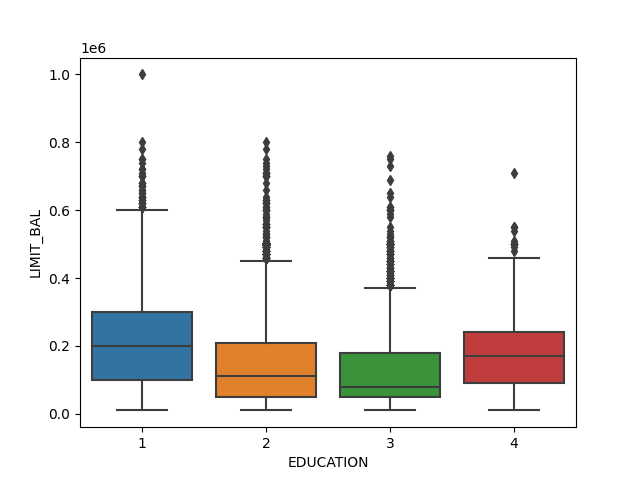

# Table of Contents
1. [Introduction](#introduction)
2. [Exploratory Data Analysis (EDA)](#exploratory-data-analysis-eda)
   - [Importing Necessary Libraries and Loading Data](#importing-necessary-libraries-and-loading-data)
   - [Checking Statistics](#checking-statistics)
   - [Data Visualization](#data-visualization)
   - [Model Training Preparation](#model-training-preparation)
3. [Logistic Regression Model](#logistic-regression-model)
   - [Model Training](#logistic-model-training)
   - [Model Evaluation](#logistic-model-evaluation)
4. [Random Forest Model](#random-forest-model)
   - [Model Training](#random-forest-model-training)
   - [Model Evaluation](#random-forest-model-evaluation)
5. [Calculation of Expected Loss](#calculation-of-expected-loss)
6. [Appendix](#appendix)
   - [Libraries Used](#libraries-used)


# Introduction <a name="introduction"></a>
This credit risk analysis project aims to predict credit card defaults using machine learning algorithms. The [dataset](https://www.kaggle.com/datasets/uciml/default-of-credit-card-clients-dataset) I used a dataset with 30,000 credit history entries. The data comprised of 25 variables including customer demographics, credit data, payment history, and bill amounts. I aim to forecast the probability of default by clients for the next month.

The main tasks involved exploratory data analysis, model training (both Logistic Regression and Random Forest), and the calculation of expected loss.

# Exploratory Data Analysis (EDA) <a name="exploratory-data-analysis-eda"></a>
Basic EDA is performed to understand the data. This includes checking statistics, histograms, and correlations.

## Importing Necessary Libraries and Loading Data <a name="importing-necessary-libraries-and-loading-data"></a>


The script begins by importing necessary libraries for data handling, analysis, visualization, and modeling.

```python
# Data handling, analysis, and visualization
import pandas as pd
import numpy as np
import seaborn as sns
import matplotlib.pyplot as plt

# Data preprocessing, modeling, and evaluation
from sklearn.model_selection import train_test_split
from sklearn.preprocessing import StandardScaler, LabelEncoder
from imblearn.over_sampling import SMOTE
from sklearn.linear_model import LogisticRegression
from sklearn.ensemble import RandomForestClassifier
from sklearn.metrics import classification_report, confusion_matrix

# Load and clean data
# Read CSV file into Python using pandas
# Initial cleaning operations are performed.
df = pd.read_csv("data.csv")
```

## Checking Statistics <a name="checking-statistics"></a>
Missing Values
```python
# Check the data
print(df.head())

# Drop 'ID' as it's not relevant
df = df.drop('ID', axis=1)

# Check missing variables 
print(df.isnull().sum())
```

```output
   ID  LIMIT_BAL  SEX  ...  PAY_AMT5  PAY_AMT6  default.payment.next.month
0   1    20000.0    2  ...       0.0       0.0                           1
1   2   120000.0    2  ...       0.0    2000.0                           1
2   3    90000.0    2  ...    1000.0    5000.0                           0
3   4    50000.0    2  ...    1069.0    1000.0                           0
4   5    50000.0    1  ...     689.0     679.0                           0

[5 rows x 25 columns]
LIMIT_BAL                     0
SEX                           0
EDUCATION                     0
MARRIAGE                      0
AGE                           0
PAY_0                         0
PAY_2                         0
PAY_3                         0
PAY_4                         0
PAY_5                         0
PAY_6                         0
BILL_AMT1                     0
BILL_AMT2                     0
BILL_AMT3                     0
BILL_AMT4                     0
BILL_AMT5                     0
BILL_AMT6                     0
PAY_AMT1                      0
PAY_AMT2                      0
PAY_AMT3                      0
PAY_AMT4                      0
PAY_AMT5                      0
PAY_AMT6                      0
default.payment.next.month    0
dtype: int64
```

Unreasonable Values
I  combine the "unknown" categories in the 'EDUCATION' variable. Because from data description, we know 4=others, 5=unknown, 6=unknown. 

```python
print(df.EDUCATION.value_counts())
```

```output
EDUCATION
2    14030
1    10585
3     4917
5      280
4      123
6       51
0       14
Name: count, dtype: int64
```
So I replaced categories 0, 5, and 6 with 4 (indicating "others").

```python
df['EDUCATION'].replace({0:4, 5:4, 6:4}, inplace=True)
print(df.EDUCATION.value_counts())
```

```output
EDUCATION
2    14030
1    10585
3     4917
4      468
Name: count, dtype: int64
```
Similarly, I replace category 0 with 3 (the "other" category) for 'MARRIAGE'. Later, I automate the process of checking each column with a loop. I chose not to show output of the loop here as there are not other unknown variables. 

```pythonprint(df['MARRIAGE'].value_counts())
df['MARRIAGE'].replace({0:3}, inplace=True)
print(df['MARRIAGE'].value_counts())

for column in df.columns:
   print(df[column].value_counts())
```
```output
MARRIAGE
2    15964
1    13659
3      323
0       54
Name: count, dtype: int64
MARRIAGE
2    15964
1    13659
3      377
```

## Data Visualization <a name="data-visualization"></a>

Histogram
```python
# Data visualization
df.hist(bins=50, figsize=(20,15))
plt.show()
```

Here is a histogram of my data:


Heatmap of the Correlation Matrix
```
corr_matrix = df.corr()
sns.heatmap(corr_matrix)
plt.show()
```
Here is a heatmap of the correlation matrix:


```
sns.boxplot(x='EDUCATION', y='LIMIT_BAL', data=df)
plt.show()
```
Boxplot of Amount of Given Credit by Education Levels
Here is a boxplot showing the distribution of the limited balance for different education levels



```
sns.boxplot(x='MARRIAGE', y='LIMIT_BAL', data=df)
plt.show()
```

Here is a boxplot showing the distribution of the limited balance for different marriage statuses: 


Barplot of Average Default Rate by Education Levels
Calculate the mean default rate for each group
```
plt.figure(figsize=(10,7))
sns.barplot(x='EDUCATION', y='default.payment.next.month', data=df)
plt.title('Default Rates by Education Level')
plt.show()
```

Here is a bar plot showing the mean default rate for each education level: 


## Model Training Preparation <a name="model-training-preparation"></a>
Data scaling

This step includes one-hot encoding of categorical variables and scaling of numerical variables.

```python
# One-hot encoding categorical variables
df_encoded = pd.get_dummies(df, columns=['EDUCATION', 'MARRIAGE'])

# Scaling numerical variable
scaler = StandardScaler()
df[['LIMIT_BAL', 'AGE']] = scaler.fit_transform(df[['LIMIT_BAL', 'AGE']])

# Separate features (X) and target (y)
X = df.drop('default.payment.next.month', axis=1)
y = df['default.payment.next.month']
```
Train-Test Split and Balancing Data <a name="train-test-split-and-balancing-data"></a>

The data is split into training and test sets, and the training set is balanced using SMOTE.

```python
# Train Test Split
X_train, X_test, y_train, y_test = train_test_split(X, y, test_size=0.20, random_state=42)

# Balance data
smote = SMOTE()
X_train, y_train = smote.fit_resample(X_train, y_train)
```

# Logistic Regression Model <a name="logistic-regression-model"></a>
A Logistic Regression model is trained, and predictions are made on the test data. The performance of the model is evaluated.

## Model Training <a name="logistic-model-training"></a>

```python
# Step 4: logistic regression model
# Initialize logistic regression model
log_reg = LogisticRegression()

# Train the model
log_reg.fit(X_train, y_train)

# Predict on test data
y_pred_lr = log_reg.predict(X_test)
```

## Model Evaluation <a name="logistic-model-evaluation"></a>


Classification Report
```python
# Evaluate the model
print(classification_report(y_test, y_pred_lr))

# Get the coefficients
coefficients = log_reg.coef_
# Convert the coefficients into one-dimensional 1darray with corresponding df column names as axis labels
coeff_series = pd.Series(coefficients[0], df.columns[:-1])
# Show the coefficients
print(coeff_series)
```

```output
Name: count, dtype: int64
              precision    recall  f1-score   support

           0       0.82      0.76      0.79      4687
           1       0.31      0.39      0.35      1313

    accuracy                           0.68      6000
   macro avg       0.56      0.58      0.57      6000
weighted avg       0.71      0.68      0.69      6000

LIMIT_BAL   -3.422496e-08
SEX         -1.451107e-09
EDUCATION    7.838366e-09
MARRIAGE    -2.178745e-09
AGE          5.321578e-09
PAY_0        7.407113e-08
PAY_2        6.198363e-08
PAY_3        5.356507e-08
PAY_4        4.978942e-08
PAY_5        4.370968e-08
PAY_6        4.052314e-08
BILL_AMT1   -7.950770e-06
BILL_AMT2    6.047089e-06
BILL_AMT3    2.172381e-06
BILL_AMT4   -6.944471e-07
BILL_AMT5    1.524004e-06
BILL_AMT6    3.622442e-06
PAY_AMT1    -2.183525e-05
PAY_AMT2    -2.080986e-05
PAY_AMT3    -6.091219e-06
PAY_AMT4    -9.870264e-06
PAY_AMT5    -8.258503e-06
PAY_AMT6    -5.657247e-06
dtype: float64
```

Logistic Regression Model:
The accuracy of the Logistic Regression model is 68%.
The precision for predicting non-default (0) is fairly high at 82%, indicating that when the model predicts non-default, it's correct 82% of the time. However, the precision for predicting default (1) is quite low at 31%, which means the model isn't as reliable when it predicts a default.
The recall, or sensitivity, for non-default predictions is 76%, and for default predictions is 39%. This means the model correctly identifies 76% of the non-default cases and 39% of the default cases.

Probability of Default (PD)
```python
# Probability of Default (PD)
y_pred_proba_lr = log_reg.predict_proba(X_test)

# y_pred_proba_lr is a 2D array with probabilities for "non-default" and "default"
# We keep only the probabilities of default
pd_lr = y_pred_proba_lr[:, 1]

# Now pd_lr contains the probability of default for each instance in the test set
print(pd_lr)
```

```output
[0.48984944 0.4963408  0.53159706 ... 0.52488158 0.46814057 0.48200682]
```

Feature Importance
```python
importances_log_reg = abs(log_reg.coef_[0]) # Get absolute values of coefficients
f_importances_log_reg = pd.Series(importances_log_reg, df.columns[:-1])
f_importances_log_reg.sort_values(ascending=False, inplace=True)
f_importances_log_reg.plot(x='Features', y='Importance', kind='bar', figsize=(16,9), rot=45, fontsize=15)

plt.tight_layout()
plt.show()
```

ROC Curve
```python
##ROC curve illustrates the diagnostic ability of a binary classifier system as its discrimination threshold is varied
#It plots the True Positive Rate (TPR) against the False Positive Rate (FPR) at various threshold settings. 
# The area under the curve (AUC) provides a measure of how well the model is capable of distinguishing between classes. 
# Higher the AUC, better the model is at predicting 0s as 0s and 1s as 1s.
from sklearn.metrics import roc_curve, auc
import matplotlib.pyplot as plt

probabilities = log_reg.predict_proba(X_test)
fpr, tpr, _ = roc_curve(y_test, probabilities[:, 1])
roc_auc = auc(fpr, tpr)
```
Here is a ROC curve that plots the True Positive Rate (TPR) against the False Positive Rate (FPR). 


The area under the curve (AUC) provides a measure of how well the model is capable of distinguishing between classes. 
Higher the AUC, better the model is at predicting 0s as 0s and 1s as 1s.

# Random Forest Model <a name="random-forest-model"></a>

Similarly, a Random Forest model is trained and evaluated.

## Model Training <a name="random-forest-model-training"></a>

```python
# Initialize random forest model
rf = RandomForestClassifier()

# Train the model
rf.fit(X_train, y_train)

# Predict on test data
y_pred_rf = rf.predict(X_test)
```
## Model Evaluation <a name="random-forest-model-evaluation"></a>
Classification Report
```python
# Evaluate the model
print(classification_report(y_test, y_pred_rf))
```

```output

              precision    recall  f1-score   support

           0       0.86      0.87      0.86      4687
           1       0.50      0.49      0.50      1313

    accuracy                           0.78      6000
   macro avg       0.68      0.68      0.68      6000
weighted avg       0.78      0.78      0.78      6000
```
The accuracy of the Random Forest model is 78%, which is higher than the Logistic Regression model.
The precision for predicting non-default (0) is also high at 86%, and it's significantly better for predicting default (1) with a precision of 50%.
The recall for non-default predictions is 87%, and for default predictions is 49%. Again, this model shows a better performance in identifying both non-default and default cases.
As for the feature importance, the coefficients from the Logistic Regression model are hard to interpret directly due to their small magnitudes. However, the signs of the coefficients indicate the direction of the relationship with the default risk. For instance, a positive sign means that as the feature value increases, the default risk also increases, and vice versa. In this case, the repayment status (PAY_0 to PAY_6) and the bill amounts (BILL_AMT1 to BILL_AMT6) seem to have a considerable impact on the default risk.


Probability of Default (PD)
```python
# How the probability of default payment varies by demographic variables?
# Get feature importances in Random Forest model
importances = rf.feature_importances_
# Convert the importances into one-dimensional 1darray with corresponding df column names as axis labels
f_importances = pd.Series(importances, df.columns[:-1])
# Sort the array in descending order of the importances
f_importances.sort_values(ascending=False, inplace=True)
# Make the bar plot from f_importances 
f_importances.plot(x='Features', y='Importance', kind='bar', figsize=(16,9), rot=45, fontsize=15)

Show the plot
plt.tight_layout()
plt.show()
```

Here is a bar plot of the feature importances as determined by the Random Forest model: 


```python
# Probability of default
y_pred_proba_rf = rf.predict_proba(X_test)

# y_pred_proba_rf is a 2D array with probabilities for "non-default" and "default"
# Keep only the probabilities of default
pd_rf = y_pred_proba_rf[:, 1]

# Now pd_rf contains the probability of default for each instance in the test set
print(pd_rf)
```

```output
[0.39 0.03 0.32 ... 0.42 0.23 0.1 ]
```


# Calculation of Expected Loss <a name="calculation-of-expected-loss"></a>

Finally, the expected loss is calculated using the formula EL = PD * EAD * LGD.

```python
#### PD, LGD, EAD
# Let's say we have these values for a single loan
PD = 0.1  # Probability of Default
EAD = 100000  # Exposure at Default
LGD = 0.8  # Loss Given Default

# Calculate Expected Loss
EL = PD * EAD * LGD
print(f'Expected Loss: {EL}')
```

```output
Expected Loss: 8000.0
```

# Appendix <a name="appendix"></a>
## Libraries Used <a name="libraries-used"></a>
- pandas
- numpy
- seaborn
- matplotlib
- sklearn
- imblearn
