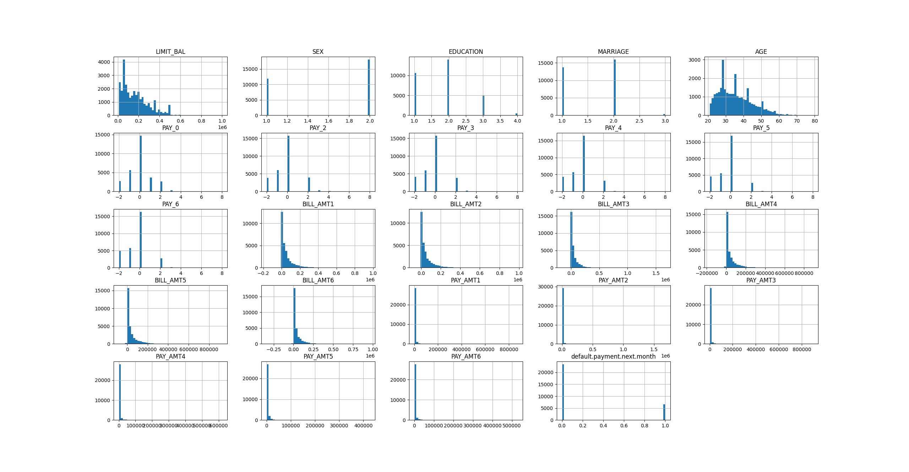

# Table of Contents
1. [Credit Risk Analysis](#credit-risk-analysis)
2. [Libraries Used](#libraries-used)
3. [Steps](#steps)
   - [Importing Necessary Libraries](#importing-necessary-libraries)
   - [Data Loading and Cleaning](#data-loading-and-cleaning)
   - [Exploratory Data Analysis (EDA)](#exploratory-data-analysis)
   - [Data Preprocessing](#data-preprocessing)
   - [Train-Test Split and Balancing Data](#train-test-split-and-balancing-data)
   - [Logistic Regression Model](#logistic-regression-model)
   - [Random Forest Model](#random-forest-model)
   - [Calculation of Expected Loss](#calculation-of-expected-loss)

# Credit Risk Analysis <a name="credit-risk-analysis"></a>

This Python script is used to perform credit risk analysis.

## Libraries Used <a name="libraries-used"></a>

- pandas
- numpy
- seaborn
- matplotlib
- sklearn
- imblearn

## Steps <a name="steps"></a>

The script is divided into the following sections:

### Importing Necessary Libraries <a name="importing-necessary-libraries"></a>

The script begins by importing necessary libraries for data handling, analysis, visualization, and modeling.

```python
# Data handling, analysis, and visualization
import pandas as pd
import numpy as np
import seaborn as sns
import matplotlib.pyplot as plt

# Data preprocessing, modeling, and evaluation
from sklearn.model_selection import train_test_split
from sklearn.preprocessing import StandardScaler, LabelEncoder
from imblearn.over_sampling import SMOTE
from sklearn.linear_model import LogisticRegression
from sklearn.ensemble import RandomForestClassifier
from sklearn.metrics import classification_report, confusion_matrix
```

### Data Loading and Cleaning <a name="data-loading-and-cleaning"></a>
The data is loaded from data.CSV file, and initial cleaning operations are performed.

```python
# Step 2: load and clean data
# Read CSV file into Python using pandas
df = pd.read_csv("data.csv")

# Check statistics of data
print(df.head())

# Drop 'ID' as it's not relevant
df = df.drop('ID', axis=1)

# Check missing variables 
print(df.isnull().sum())
```

```output
   ID  LIMIT_BAL  SEX  ...  PAY_AMT5  PAY_AMT6  default.payment.next.month
0   1    20000.0    2  ...       0.0       0.0                           1
1   2   120000.0    2  ...       0.0    2000.0                           1
2   3    90000.0    2  ...    1000.0    5000.0                           0
3   4    50000.0    2  ...    1069.0    1000.0                           0
4   5    50000.0    1  ...     689.0     679.0                           0

[5 rows x 25 columns]
LIMIT_BAL                     0
SEX                           0
EDUCATION                     0
MARRIAGE                      0
AGE                           0
PAY_0                         0
PAY_2                         0
PAY_3                         0
PAY_4                         0
PAY_5                         0
PAY_6                         0
BILL_AMT1                     0
BILL_AMT2                     0
BILL_AMT3                     0
BILL_AMT4                     0
BILL_AMT5                     0
BILL_AMT6                     0
PAY_AMT1                      0
PAY_AMT2                      0
PAY_AMT3                      0
PAY_AMT4                      0
PAY_AMT5                      0
PAY_AMT6                      0
default.payment.next.month    0
dtype: int64
```

# Check value counts in EDUCATION for unreasonable or unknown variables
```python
print(df.EDUCATION.value_counts())
```

```output
EDUCATION
2    14030
1    10585
3     4917
5      280
4      123
6       51
0       14
Name: count, dtype: int64
```
## Combine the "unknown" categories in the 'EDUCATION' variable
# From data description, we know 4=others, 5=unknown, 6=unknown
# So I replaced categories 0, 5, and 6 with 4 (indicating "others")
```python
df['EDUCATION'].replace({0:4, 5:4, 6:4}, inplace=True)
print(df.EDUCATION.value_counts())
```

```output
EDUCATION
2    14030
1    10585
3     4917
4      468
Name: count, dtype: int64
```

# Similarly, I replace category 0 with 3 (the "other" category) for 'MARRIAGE'
```pythonprint(df['MARRIAGE'].value_counts())
df['MARRIAGE'].replace({0:3}, inplace=True)
print(df['MARRIAGE'].value_counts())
```
```output
MARRIAGE
2    15964
1    13659
3      323
0       54
Name: count, dtype: int64
MARRIAGE
2    15964
1    13659
3      377
```

# Automate the process of checking each column with a loop
```python
for column in df.columns:
   print(df[column].value_counts())
```

```output
LIMIT_BAL
50000.0      3365
20000.0      1976
30000.0      1610
80000.0      1567
200000.0     1528
             ... 
730000.0        2
1000000.0       1
327680.0        1
760000.0        1
690000.0        1
Name: count, Length: 81, dtype: int64
SEX
2    18112
1    11888
Name: count, dtype: int64
EDUCATION
2    14030
1    10585
3     4917
4      468
Name: count, dtype: int64
MARRIAGE
2    15964
1    13659
3      377
Name: count, dtype: int64
AGE
29    1605
27    1477
28    1409
30    1395
26    1256
31    1217
25    1186
34    1162
32    1158
33    1146
24    1127
35    1113
36    1108
37    1041
39     954
38     944
23     931
40     870
41     824
42     794
44     700
43     670
45     617
46     570
22     560
47     501
48     466
49     452
50     411
51     340
53     325
52     304
54     247
55     209
56     178
58     122
57     122
59      83
60      67
21      67
61      56
62      44
63      31
64      31
66      25
65      24
67      16
69      15
70      10
68       5
73       4
72       3
75       3
71       3
79       1
74       1
Name: count, dtype: int64
PAY_0
 0    14737
-1     5686
 1     3688
-2     2759
 2     2667
 3      322
 4       76
 5       26
 8       19
 6       11
 7        9
Name: count, dtype: int64
PAY_2
 0    15730
-1     6050
 2     3927
-2     3782
 3      326
 4       99
 1       28
 5       25
 7       20
 6       12
 8        1
Name: count, dtype: int64
PAY_3
 0    15764
-1     5938
-2     4085
 2     3819
 3      240
 4       76
 7       27
 6       23
 5       21
 1        4
 8        3
Name: count, dtype: int64
PAY_4
 0    16455
-1     5687
-2     4348
 2     3159
 3      180
 4       69
 7       58
 5       35
 6        5
 1        2
 8        2
Name: count, dtype: int64
PAY_5
 0    16947
-1     5539
-2     4546
 2     2626
 3      178
 4       84
 7       58
 5       17
 6        4
 8        1
Name: count, dtype: int64
PAY_6
 0    16286
-1     5740
-2     4895
 2     2766
 3      184
 4       49
 7       46
 6       19
 5       13
 8        2
Name: count, dtype: int64
BILL_AMT1
0.0         2008
390.0        244
780.0         76
326.0         72
316.0         63
            ... 
11636.0        1
146034.0       1
20817.0        1
1351.0         1
47929.0        1
Name: count, Length: 22723, dtype: int64
BILL_AMT2
0.0        2506
390.0       231
326.0        75
780.0        75
316.0        72
           ... 
26357.0       1
85195.0       1
6889.0        1
11004.0       1
48905.0       1
Name: count, Length: 22346, dtype: int64
BILL_AMT3
0.0         2870
390.0        275
780.0         74
326.0         63
316.0         62
            ... 
19580.0        1
45129.0        1
227807.0       1
39330.0        1
49764.0        1
Name: count, Length: 22026, dtype: int64
BILL_AMT4
0.0         3195
390.0        246
780.0        101
316.0         68
326.0         62
            ... 
97189.0        1
118839.0       1
23567.0        1
18377.0        1
36535.0        1
Name: count, Length: 21548, dtype: int64
BILL_AMT5
0.0        3506
390.0       235
780.0        94
316.0        79
326.0        62
           ... 
19341.0       1
66726.0       1
80682.0       1
28508.0       1
32428.0       1
Name: count, Length: 21010, dtype: int64
BILL_AMT6
0.0         4020
390.0        207
780.0         86
150.0         78
316.0         77
            ... 
26852.0        1
108660.0       1
480.0          1
15298.0        1
15313.0        1
Name: count, Length: 20604, dtype: int64
PAY_AMT1
0.0        5249
2000.0     1363
3000.0      891
5000.0      698
1500.0      507
           ... 
3391.0        1
7785.0        1
66022.0       1
10121.0       1
85900.0       1
Name: count, Length: 7943, dtype: int64
PAY_AMT2
0.0        5396
2000.0     1290
3000.0      857
5000.0      717
1000.0      594
           ... 
7866.0        1
6206.0        1
10529.0       1
21300.0       1
3526.0        1
Name: count, Length: 7899, dtype: int64
PAY_AMT3
0.0        5968
2000.0     1285
1000.0     1103
3000.0      870
5000.0      721
           ... 
5102.0        1
5368.0        1
28138.0       1
549.0         1
25128.0       1
Name: count, Length: 7518, dtype: int64
PAY_AMT4
0.0        6408
1000.0     1394
2000.0     1214
3000.0      887
5000.0      810
           ... 
18916.0       1
3468.0        1
11476.0       1
4363.0        1
8049.0        1
Name: count, Length: 6937, dtype: int64
PAY_AMT5
0.0        6703
1000.0     1340
2000.0     1323
3000.0      947
5000.0      814
           ... 
9111.0        1
16496.0       1
4819.0        1
10078.0       1
52964.0       1
Name: count, Length: 6897, dtype: int64
PAY_AMT6
0.0        7173
1000.0     1299
2000.0     1295
3000.0      914
5000.0      808
           ... 
7329.0        1
6862.0        1
6525.0        1
11894.0       1
16080.0       1
Name: count, Length: 6939, dtype: int64
default.payment.next.month
0    23364
1     6636
Name: count, dtype: int64
```

### Exploratory Data Analysis (EDA) <a name="exploratory-data-analysis"></a>

Basic EDA is performed to understand the data. This includes checking statistics, histograms, and correlations.

```python
# Data visualization
df.hist(bins=50, figsize=(20,15))
plt.show()

corr_matrix = df.corr()
sns.heatmap(corr_matrix)
plt.show()

sns.boxplot(x='EDUCATION', y='LIMIT_BAL', data=df)
plt.show()

sns.boxplot(x='MARRIAGE', y='LIMIT_BAL', data=df)
plt.show()

# Calculate the mean default rate for each group
plt.figure(figsize=(10,7))
sns.barplot(x='EDUCATION', y='default.payment.next.month', data=df)
plt.title('Default Rates by Education Level')
plt.show()
```

```output
Here is a histogram of my data:


Here is a heatmap of the correlation matrix: 


Here is a boxplot showing the distribution of the limited balance for different education levels


Here is a boxplot showing the distribution of the limited balance for different marriage statuses: 


Here is a bar plot showing the mean default rate for each education level: 

```

### Data Preprocessing <a name="data-preprocessing"></a>

This step includes one-hot encoding of categorical variables and scaling of numerical variables.

```python
# One-hot encoding categorical variables
df_encoded = pd.get_dummies(df, columns=['EDUCATION', 'MARRIAGE'])

# Scaling numerical variable
scaler = StandardScaler()
df[['LIMIT_BAL', 'AGE']] = scaler.fit_transform(df[['LIMIT_BAL', 'AGE']])

# Separate features (X) and target (y)
X = df.drop('default.payment.next.month', axis=1)
y = df['default.payment.next.month']
```

### Train-Test Split and Balancing Data <a name="train-test-split-and-balancing-data"></a>

The data is split into training and test sets, and the training set is balanced using SMOTE.

```python
# Train Test Split
X_train, X_test, y_train, y_test = train_test_split(X, y, test_size=0.20, random_state=42)

# Balance data
smote = SMOTE()
X_train, y_train = smote.fit_resample(X_train, y_train)
```

### Logistic Regression Model <a name="logistic-regression-model"></a>

A Logistic Regression model is trained, and predictions are made on the test data. The performance of the model is evaluated.

```python
# Step 4: logistic regression model
# Initialize logistic regression model
log_reg = LogisticRegression()

# Train the model
log_reg.fit(X_train, y_train)

# Predict on test data
y_pred_lr = log_reg.predict(X_test)

# Evaluate the model
print(classification_report(y_test, y_pred_lr))

# Get the coefficients
coefficients = log_reg.coef_
# Convert the coefficients into one-dimensional 1darray with corresponding df column names as axis labels
coeff_series = pd.Series(coefficients[0], df.columns[:-1])
# Show the coefficients
print(coeff_series)

# Probability of default (PD)
y_pred_proba_lr = log_reg.predict_proba(X_test)

# y_pred_proba_lr is a 2D array with probabilities for "non-default" and "default"
# We keep only the probabilities of default
pd_lr = y_pred_proba_lr[:, 1]

# Now pd_lr contains the probability of default for each instance in the test set
print(pd_lr)
```

```output
Name: count, dtype: int64
              precision    recall  f1-score   support

           0       0.82      0.76      0.79      4687
           1       0.31      0.39      0.35      1313

    accuracy                           0.68      6000
   macro avg       0.56      0.58      0.57      6000
weighted avg       0.71      0.68      0.69      6000

LIMIT_BAL   -3.422496e-08
SEX         -1.451107e-09
EDUCATION    7.838366e-09
MARRIAGE    -2.178745e-09
AGE          5.321578e-09
PAY_0        7.407113e-08
PAY_2        6.198363e-08
PAY_3        5.356507e-08
PAY_4        4.978942e-08
PAY_5        4.370968e-08
PAY_6        4.052314e-08
BILL_AMT1   -7.950770e-06
BILL_AMT2    6.047089e-06
BILL_AMT3    2.172381e-06
BILL_AMT4   -6.944471e-07
BILL_AMT5    1.524004e-06
BILL_AMT6    3.622442e-06
PAY_AMT1    -2.183525e-05
PAY_AMT2    -2.080986e-05
PAY_AMT3    -6.091219e-06
PAY_AMT4    -9.870264e-06
PAY_AMT5    -8.258503e-06
PAY_AMT6    -5.657247e-06
dtype: float64
[0.48984944 0.4963408  0.53159706 ... 0.52488158 0.46814057 0.48200682]
```

### Random Forest Model <a name="random-forest-model"></a>

Similarly, a Random Forest model is trained and evaluated.

```python
# Step 5: random forest model
# Initialize random forest model
rf = RandomForestClassifier()

# Train the model
rf.fit(X_train, y_train)

# Predict on test data
y_pred_rf = rf.predict(X_test)

# Evaluate the model
print(classification_report(y_test, y_pred_rf))

# How the probability of default payment varies by demographic variables?
# Get feature importances in Random Forest model
importances = rf.feature_importances_
# Convert the importances into one-dimensional 1darray with corresponding df column names as axis labels
f_importances = pd.Series(importances, df.columns[:-1])
# Sort the array in descending order of the importances
f_importances.sort_values(ascending=False, inplace=True)
# Make the bar plot from f_importances 
f_importances.plot(x='Features', y='Importance', kind='bar', figsize=(16,9), rot=45, fontsize=15)
# Show the plot
plt.tight_layout()
plt.show()

# Probability of default
y_pred_proba_rf = rf.predict_proba(X_test)

# y_pred_proba_rf is a 2D array with probabilities for "non-default" and "default"
# Keep only the probabilities of default
pd_rf = y_pred_proba_rf[:, 1]

# Now pd_rf contains the probability of default for each instance in the test set
print(pd_rf)
```

```output

              precision    recall  f1-score   support

           0       0.86      0.87      0.86      4687
           1       0.50      0.49      0.50      1313

    accuracy                           0.78      6000
   macro avg       0.68      0.68      0.68      6000
weighted avg       0.78      0.78      0.78      6000

[0.39 0.03 0.32 ... 0.42 0.23 0.1 ]


Here is a bar plot of the feature importances as determined by the Random Forest model: 


```

### Calculation of Expected Loss <a name="calculation-of-expected-loss"></a>

Finally, the expected loss is calculated using the formula EL = PD * EAD * LGD.

```python
#### PD, LGD, EAD
# Let's say we have these values for a single loan
PD = 0.1  # Probability of Default
EAD = 100000  # Exposure at Default
LGD = 0.8  # Loss Given Default

# Calculate Expected Loss
EL = PD * EAD * LGD
print(f'Expected Loss: {EL}')
```

```output
Expected Loss: 8000.0
```