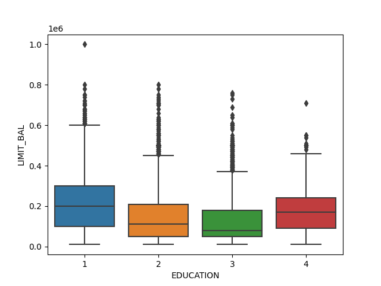
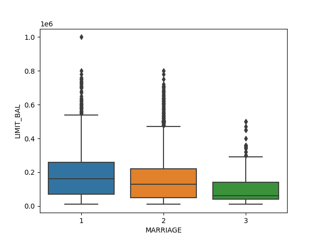
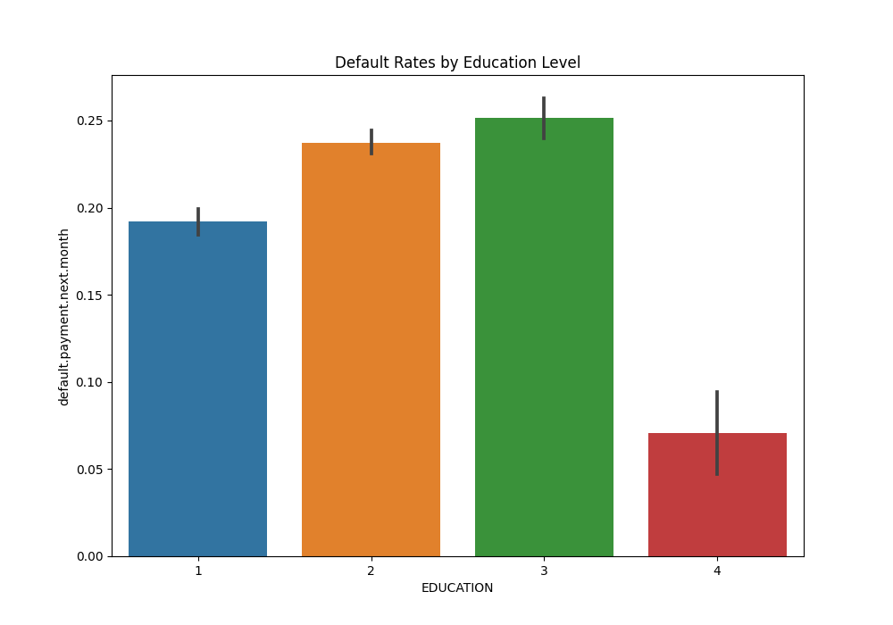
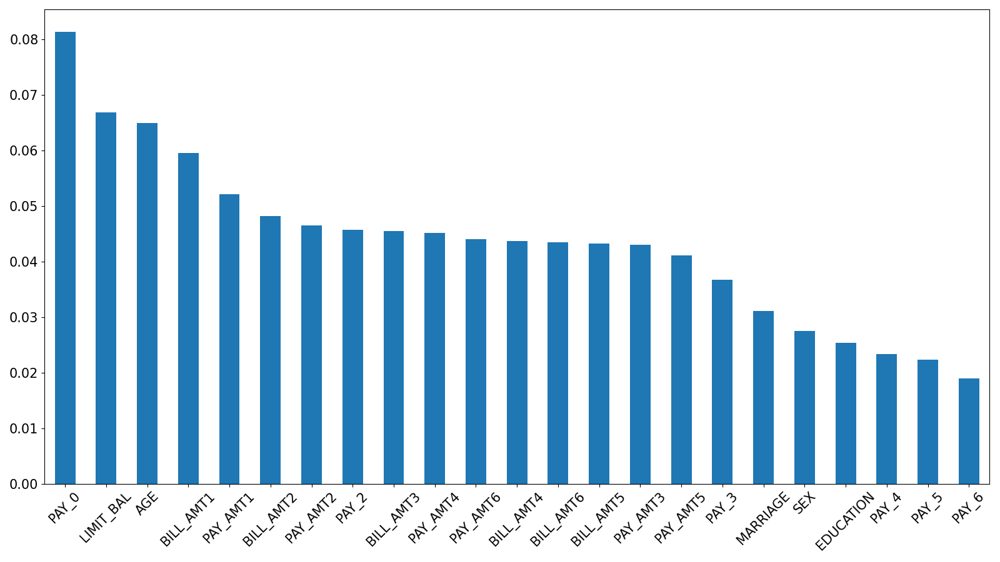

# Table of Contents
1. [Credit Risk Analysis](#credit-risk-analysis)
2. [Libraries Used](#libraries-used)
3. [Steps](#steps)
   - [Importing Necessary Libraries](#importing-necessary-libraries)
   - [Data Loading and Cleaning](#data-loading-and-cleaning)
   - [Exploratory Data Analysis (EDA)](#exploratory-data-analysis)
   - [Data Preprocessing](#data-preprocessing)
   - [Train-Test Split and Balancing Data](#train-test-split-and-balancing-data)
   - [Logistic Regression Model](#logistic-regression-model)
   - [Random Forest Model](#random-forest-model)
   - [Calculation of Expected Loss](#calculation-of-expected-loss)

# Credit Risk Analysis <a name="credit-risk-analysis"></a>

This Python script is used to perform credit risk analysis.

## Libraries Used <a name="libraries-used"></a>

- pandas
- numpy
- seaborn
- matplotlib
- sklearn
- imblearn

## Steps <a name="steps"></a>

The script is divided into the following sections:

### Importing Necessary Libraries <a name="importing-necessary-libraries"></a>

The script begins by importing necessary libraries for data handling, analysis, visualization, and modeling.

```python
# Data handling, analysis, and visualization
import pandas as pd
import numpy as np
import seaborn as sns
import matplotlib.pyplot as plt

# Data preprocessing, modeling, and evaluation
from sklearn.model_selection import train_test_split
from sklearn.preprocessing import StandardScaler, LabelEncoder
from imblearn.over_sampling import SMOTE
from sklearn.linear_model import LogisticRegression
from sklearn.ensemble import RandomForestClassifier
from sklearn.metrics import classification_report, confusion_matrix
```

### Data Loading and Cleaning <a name="data-loading-and-cleaning"></a>
The data is loaded from data.CSV file, and initial cleaning operations are performed.

```python
# Step 2: load and clean data
# Read CSV file into Python using pandas
df = pd.read_csv("data.csv")

# Check statistics of data
print(df.head())

# Drop 'ID' as it's not relevant
df = df.drop('ID', axis=1)

# Check missing variables 
print(df.isnull().sum())
```

```output
   ID  LIMIT_BAL  SEX  ...  PAY_AMT5  PAY_AMT6  default.payment.next.month
0   1    20000.0    2  ...       0.0       0.0                           1
1   2   120000.0    2  ...       0.0    2000.0                           1
2   3    90000.0    2  ...    1000.0    5000.0                           0
3   4    50000.0    2  ...    1069.0    1000.0                           0
4   5    50000.0    1  ...     689.0     679.0                           0

[5 rows x 25 columns]
LIMIT_BAL                     0
SEX                           0
EDUCATION                     0
MARRIAGE                      0
AGE                           0
PAY_0                         0
PAY_2                         0
PAY_3                         0
PAY_4                         0
PAY_5                         0
PAY_6                         0
BILL_AMT1                     0
BILL_AMT2                     0
BILL_AMT3                     0
BILL_AMT4                     0
BILL_AMT5                     0
BILL_AMT6                     0
PAY_AMT1                      0
PAY_AMT2                      0
PAY_AMT3                      0
PAY_AMT4                      0
PAY_AMT5                      0
PAY_AMT6                      0
default.payment.next.month    0
dtype: int64
```

Check value counts in EDUCATION for unreasonable or unknown variables
```python
print(df.EDUCATION.value_counts())
```

```output
EDUCATION
2    14030
1    10585
3     4917
5      280
4      123
6       51
0       14
Name: count, dtype: int64
```
Combine the "unknown" categories in the 'EDUCATION' variable
From data description, we know 4=others, 5=unknown, 6=unknown
So I replaced categories 0, 5, and 6 with 4 (indicating "others")
```python
df['EDUCATION'].replace({0:4, 5:4, 6:4}, inplace=True)
print(df.EDUCATION.value_counts())
```

```output
EDUCATION
2    14030
1    10585
3     4917
4      468
Name: count, dtype: int64
```

Similarly, I replace category 0 with 3 (the "other" category) for 'MARRIAGE'
```pythonprint(df['MARRIAGE'].value_counts())
df['MARRIAGE'].replace({0:3}, inplace=True)
print(df['MARRIAGE'].value_counts())
```
```output
MARRIAGE
2    15964
1    13659
3      323
0       54
Name: count, dtype: int64
MARRIAGE
2    15964
1    13659
3      377
```

Automate the process of checking each column with a loop. There are not unknown variables in other columns so I chose not to show output here. 
```python
for column in df.columns:
   print(df[column].value_counts())
```

### Exploratory Data Analysis (EDA) <a name="exploratory-data-analysis"></a>

Basic EDA is performed to understand the data. This includes checking statistics, histograms, and correlations.

```python
# Data visualization
df.hist(bins=50, figsize=(20,15))
plt.show()
```

Here is a histogram of my data:


```
corr_matrix = df.corr()
sns.heatmap(corr_matrix)
plt.show()
```

Here is a heatmap of the correlation matrix: 


```
sns.boxplot(x='EDUCATION', y='LIMIT_BAL', data=df)
plt.show()
```

Here is a boxplot showing the distribution of the limited balance for different education levels



```
sns.boxplot(x='MARRIAGE', y='LIMIT_BAL', data=df)
plt.show()
```

Here is a boxplot showing the distribution of the limited balance for different marriage statuses: 



Calculate the mean default rate for each group
```
plt.figure(figsize=(10,7))
sns.barplot(x='EDUCATION', y='default.payment.next.month', data=df)
plt.title('Default Rates by Education Level')
plt.show()
```


Here is a bar plot showing the mean default rate for each education level: 



### Data Preprocessing <a name="data-preprocessing"></a>

This step includes one-hot encoding of categorical variables and scaling of numerical variables.

```python
# One-hot encoding categorical variables
df_encoded = pd.get_dummies(df, columns=['EDUCATION', 'MARRIAGE'])

# Scaling numerical variable
scaler = StandardScaler()
df[['LIMIT_BAL', 'AGE']] = scaler.fit_transform(df[['LIMIT_BAL', 'AGE']])

# Separate features (X) and target (y)
X = df.drop('default.payment.next.month', axis=1)
y = df['default.payment.next.month']
```

### Train-Test Split and Balancing Data <a name="train-test-split-and-balancing-data"></a>

The data is split into training and test sets, and the training set is balanced using SMOTE.

```python
# Train Test Split
X_train, X_test, y_train, y_test = train_test_split(X, y, test_size=0.20, random_state=42)

# Balance data
smote = SMOTE()
X_train, y_train = smote.fit_resample(X_train, y_train)
```

### Logistic Regression Model <a name="logistic-regression-model"></a>

A Logistic Regression model is trained, and predictions are made on the test data. The performance of the model is evaluated.

```python
# Step 4: logistic regression model
# Initialize logistic regression model
log_reg = LogisticRegression()

# Train the model
log_reg.fit(X_train, y_train)

# Predict on test data
y_pred_lr = log_reg.predict(X_test)

# Evaluate the model
print(classification_report(y_test, y_pred_lr))

# Get the coefficients
coefficients = log_reg.coef_
# Convert the coefficients into one-dimensional 1darray with corresponding df column names as axis labels
coeff_series = pd.Series(coefficients[0], df.columns[:-1])
# Show the coefficients
print(coeff_series)

# Probability of default (PD)
y_pred_proba_lr = log_reg.predict_proba(X_test)

# y_pred_proba_lr is a 2D array with probabilities for "non-default" and "default"
# We keep only the probabilities of default
pd_lr = y_pred_proba_lr[:, 1]

# Now pd_lr contains the probability of default for each instance in the test set
print(pd_lr)
```

```output
Name: count, dtype: int64
              precision    recall  f1-score   support

           0       0.82      0.76      0.79      4687
           1       0.31      0.39      0.35      1313

    accuracy                           0.68      6000
   macro avg       0.56      0.58      0.57      6000
weighted avg       0.71      0.68      0.69      6000

LIMIT_BAL   -3.422496e-08
SEX         -1.451107e-09
EDUCATION    7.838366e-09
MARRIAGE    -2.178745e-09
AGE          5.321578e-09
PAY_0        7.407113e-08
PAY_2        6.198363e-08
PAY_3        5.356507e-08
PAY_4        4.978942e-08
PAY_5        4.370968e-08
PAY_6        4.052314e-08
BILL_AMT1   -7.950770e-06
BILL_AMT2    6.047089e-06
BILL_AMT3    2.172381e-06
BILL_AMT4   -6.944471e-07
BILL_AMT5    1.524004e-06
BILL_AMT6    3.622442e-06
PAY_AMT1    -2.183525e-05
PAY_AMT2    -2.080986e-05
PAY_AMT3    -6.091219e-06
PAY_AMT4    -9.870264e-06
PAY_AMT5    -8.258503e-06
PAY_AMT6    -5.657247e-06
dtype: float64
[0.48984944 0.4963408  0.53159706 ... 0.52488158 0.46814057 0.48200682]
```

### Random Forest Model <a name="random-forest-model"></a>

Similarly, a Random Forest model is trained and evaluated.

```python
# Step 5: random forest model
# Initialize random forest model
rf = RandomForestClassifier()

# Train the model
rf.fit(X_train, y_train)

# Predict on test data
y_pred_rf = rf.predict(X_test)

# Evaluate the model
print(classification_report(y_test, y_pred_rf))

# How the probability of default payment varies by demographic variables?
# Get feature importances in Random Forest model
importances = rf.feature_importances_
# Convert the importances into one-dimensional 1darray with corresponding df column names as axis labels
f_importances = pd.Series(importances, df.columns[:-1])
# Sort the array in descending order of the importances
f_importances.sort_values(ascending=False, inplace=True)
# Make the bar plot from f_importances 
f_importances.plot(x='Features', y='Importance', kind='bar', figsize=(16,9), rot=45, fontsize=15)
# Show the plot
plt.tight_layout()
plt.show()

# Probability of default
y_pred_proba_rf = rf.predict_proba(X_test)

# y_pred_proba_rf is a 2D array with probabilities for "non-default" and "default"
# Keep only the probabilities of default
pd_rf = y_pred_proba_rf[:, 1]

# Now pd_rf contains the probability of default for each instance in the test set
print(pd_rf)
```

```output

              precision    recall  f1-score   support

           0       0.86      0.87      0.86      4687
           1       0.50      0.49      0.50      1313

    accuracy                           0.78      6000
   macro avg       0.68      0.68      0.68      6000
weighted avg       0.78      0.78      0.78      6000

[0.39 0.03 0.32 ... 0.42 0.23 0.1 ]


Here is a bar plot of the feature importances as determined by the Random Forest model: 


```

### Calculation of Expected Loss <a name="calculation-of-expected-loss"></a>

Finally, the expected loss is calculated using the formula EL = PD * EAD * LGD.

```python
#### PD, LGD, EAD
# Let's say we have these values for a single loan
PD = 0.1  # Probability of Default
EAD = 100000  # Exposure at Default
LGD = 0.8  # Loss Given Default

# Calculate Expected Loss
EL = PD * EAD * LGD
print(f'Expected Loss: {EL}')
```

```output
Expected Loss: 8000.0
```